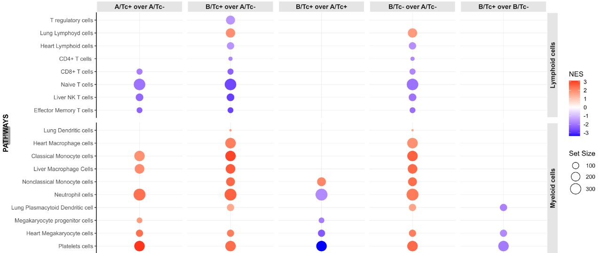

<!-- README.md is generated from README.Rmd. Please edit that file -->

```{r, include = FALSE}
knitr::opts_chunk$set(
  collapse = TRUE,
  comment = "#>",
  fig.path = "man/figures/README-",
  out.width = "80%",
  fig.align = "center",
  dpi = 600
)
```

# OmicsKit

<!-- badges: start -->

<!-- badges: end -->

The goal of OmicsKit is to help in manipulating tables and generating plots for multi-omics analyses including genomics, transcriptomics, proteomics, methylomics and immunoinformatics.

---

## Installation

You can install the development version of OmicsKit from [GitHub](https://github.com/) with:

``` r
# Install the remotes package if needed
install.packages("remotes")

# Install from GitHub
remotes::install_github("BigMindLab/OmicsKit")

# Call library for usage
library(OmicsKit)
```

```{r load data, echo = FALSE, message = FALSE}
load(".RData")
```

## Key features

- **Gene Annotation**: Retrieve information from Ensembl and BioMart to annotate gene counts tables, including transcript and gene names, genomic coordinates, and cross-references from various annotation databases.

``` r
# Example on generating transcript annotations file from Ensembl release 103

tx2gene <- get_annotations(rownames(txi$counts),
                           version = "103",
                           format = "xlsx")
```

```{r annotations, echo=FALSE}
tx2gene
```

- **Dimensionality Reduction**: Generate a range of visually appealing plots for high-dimensional data. Includes unsupervised clustering methods as well.

    - *PCA* (Principal Component Analysis).

    ```{r, eval = FALSE}
    nice_PCA(object = transf.data,
             PCs = c(1, 2),
             ntop =  200,
             returnData = FALSE,
             variables = c(fill = "group", shape = "sex"),
             legend_names = c(fill = "Group", shape = "Sex"),
             size = 9,
             alpha = 1,
             shapes = 21:22,
             colors = my_colors,
             legend_title = 10,
             legend_elements = 8,
             legend_pos = c(0.80, 0.80, "right"),
             labels = c(var = "id", size = 3))
    ```

    ```{r pca, echo = FALSE}
    pca12
    ```
         
    - *tSNE* (t-distributed Stochastic Neighbor Embedding).

    ```{r, eval = FALSE}
    nice_tSNE(object = transf.data,
              seed = 0,
              perplexity = 3,
              max_iterations = 10000,
              returnData = FALSE,
              variables = c(fill = "group", shape = "sex"),
              legend_names = c(fill = "Group", shape = "Sex"),
              size = 9,
              alpha = 1,
              shapes = 21:22,
              colors = my_colors,
              legend_title = 10,
              legend_elements = 8,
              legend_pos = c(0.80, 0.80, "right"),
              labels = c(var = "num", size = 3))
    ```

    ```{r tsne, echo = FALSE}
    p.tsne
    ```
   
    - *UMAP* (Uniform Manifold Approximation and Projection).  

    ```{r, eval = FALSE}
    nice_UMAP(object = transf.data,
              neighbors = 4,
              components = 3,
              epochs = 10000,
              returnData = FALSE,
              variables = c(fill = "group", shape = "sex"),
              legend_names = c(fill = "Group", shape = "Sex"),
              shapes = 21:22,
              colors = my_colors,
              size = 9,
              alpha = 1,
              legend_title = 10,
              legend_elements = 8,
              legend_pos = c(0.80, 0.80, "right"),
              labels = c(var = "num", size = 3))
    ```

    ```{r umap, echo = FALSE}
    p.umap
    ```

-   **Counts Normalization**: Compute and extract normalized counts such as TPM, RPKM, FPKM, and the normalized counts from DESeq2.

``` r
# Retrieve TPMs
gene.tpm <- tpm(raw_counts = counts.gene,
                gene_lengths = counts.gene_annotations$gene_length)

# Convert to data frame
gene.tpm <- data.frame(gene.tpm)

# Add annotations
gene.tpm.annotated <- add_annotations(object = gene.tpm,
                                      reference = geneID.details,
                                      variables = annotations)
```

```{r normalization, echo=FALSE}
gene.tpm.annotated
```

- **Differential Expression Results**: Filter and export differential expression analysis results into MS Excel or CSV formats. Filtering criteria include:
    -  Expression change (log2 fold change).
    -  Significance (False Discovery Rate, FDR).
    -  *Detectability* ([`Requena et al., 2024, Nat. Comms.`](#article)).

``` r
detect_list <- detect_filter(norm.counts = normalized.counts[, 1:21],
                             df.BvsA = res.T_N.sig,
                             df.CvsA = res.M_N.sig,
                             df.DvsA = NULL,
                             cutoffs = c(50, 50, 0),
                             samples.baseline = 1:3,
                             samples.condition1 = 4:6,
                             samples.condition2 = 7:9,
                             samples.condition3 = NULL)
```

```{r detectability, echo=FALSE}
detect_list
```

- **Case Organization**: Automatically categorize results from three pairwise differential expression analyses or Gene Set Enrichment Analysis (e.g., B vs A, C vs A, C vs B) into 10 mutually exclusive cases (`BigMind, 2024, manuscript in preparation`).

``` r
DEGs_sig <- split_cases(df.BvsA = res.T_N,
                        df.CvsA = res.M_N,
                        df.BvsC = res.M_T,
                        unique_id = "ensembl",
                        significance_var = "padj",
                        significance_cutoff = 0.25,
                        change_var = "log2FoldChange",
                        change_cutoff = 0)

# Filter the whole detectability list by a new threshold

for (i in names(DEGs_sig)) {
  DEGs_sig[[i]] <- DEGs_sig[[i]][rownames(DEGs_sig[[i]]) %in% detect_list$DetectGenes, ]
  DEGs_sig[[i]] <- DEGs_sig[[i]][DEGs_sig[[i]]$padj < 0.05, ]
}
```

```{r split cases, echo=FALSE}
DEGs_sig[c(6, 8:9)]
```

- **Customary plots**: Generate a range of visually appealing plots to display differential expression analysis results. Here are some examples
    
    - *Volcano plots*  
    
    ```{r, echo = FALSE}
    knitr::include_graphics("man/figures/README-Volcano_plot.jpg")
    ```

    - *Heatmaps*  
    ```{r, echo = FALSE}
    
    ```

    - *Enrichment plots*  

    ```{r, echo = FALSE}
    
    ```

    - *Box-Scatter-Violin (BSV) plots*  

    ```{r, echo = FALSE}
    knitr::include_graphics("man/figures/README-BSV_plot.jpeg")
    ```

## Examples

For a more detailed workflow on Differential Expression Analysis with the application of the `OmicsKit` suit please check the custom [BigMind](https://github.com/BigMindLab)'s pipeline for [DESeq2](https://github.com/BigMindLab/DESeq2).

## Developed by

-   David R. Requena Anicama, Ph.D.

    -   Author's name: David Requena
    -   [Google Scholar](https://scholar.google.com/citations?user=uI01iS4AAAAJ&hl=en)
    -   [ORCID: 0000-0002-5968-1133](https://orcid.org/0000-0002-5968-1133)

-   Daniel F. Guevara Díaz, B.Sc.(s)

    -   Author's name: Daniel F. Guevara-Díaz
    -   [Google Scholar](https://scholar.google.com/citations?hl=en&user=tqT7vr8AAAAJ)
    -   [ORCID: 0009-0001-2786-8729](https://orcid.org/0009-0001-2786-8729)

## License

CC BY-NC-SA 4.0

## Contact

[david.requena\@nyulangone.org](mailto:david.requena@nyulangone.org)
