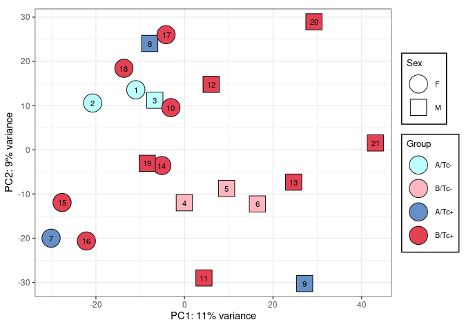
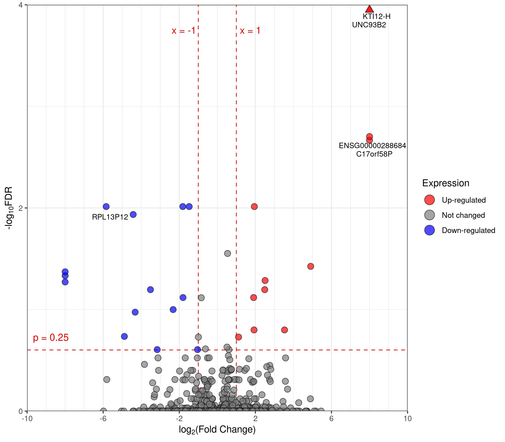
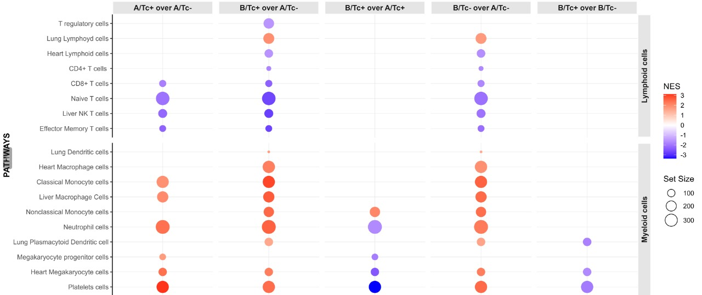
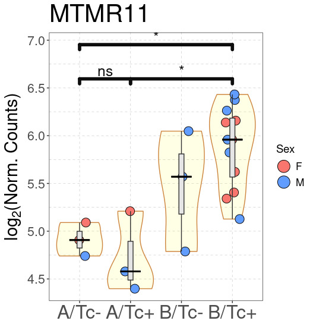

<!-- README.md is generated from README.Rmd. Please edit that file -->

# OmicsKit

<!-- badges: start -->
<!-- badges: end -->

The goal of OmicsKit is to help in manipulating tables and generating
plots for multi-omics analyses including genomics, transcriptomics,
proteomics, methylomics and immunoinformatics.

## Installation

You can install the development version of OmicsKit from
[GitHub](https://github.com/) with:

``` r
# Install the remotes package if needed
install.packages("remotes")

# Install from GitHub
remotes::install_github("BigMindLab/OmicsKit")

# Call library for usage
library(OmicsKit)
```

    #> 

## Key features

- **Gene Annotation**: Retrieve information from Ensembl and BioMart to
  annotate gene counts tables, including transcript and gene names,
  genomic coordinates, and cross-references from various annotation
  databases.

``` r
# Example on generating transcript annotations file from Ensembl release 103

tx2gene <- get_annotations(rownames(txi$counts),
                           version = "103",
                           format = "xlsx")
```

    #>          transcriptID          geneID  symbol        biotype chromosome
    #> 1  ENST00000000233.10 ENSG00000004059    ARF5 protein_coding          7
    #> 2   ENST00000000412.8 ENSG00000003056    M6PR protein_coding         12
    #> 3  ENST00000000442.11 ENSG00000173153   ESRRA protein_coding         11
    #> 4   ENST00000001008.6 ENSG00000004478   FKBP4 protein_coding         12
    #> 5   ENST00000001146.7 ENSG00000003137 CYP26B1 protein_coding          2
    #> 6   ENST00000002125.9 ENSG00000003509 NDUFAF7 protein_coding          2
    #> 7  ENST00000002165.11 ENSG00000001036   FUCA2 protein_coding          6
    #> 8  ENST00000002501.11 ENSG00000003249  DBNDD1 protein_coding         16
    #> 9   ENST00000002596.6 ENSG00000002587  HS3ST1 protein_coding          4
    #> 10  ENST00000002829.8 ENSG00000001617  SEMA3F protein_coding          3
    #>    gene_start  gene_end gene_length
    #> 1   127588386 127591700        3315
    #> 2     8940361   8949761        9401
    #> 3    64305497  64316743       11247
    #> 4     2794970   2805423       10454
    #> 5    72129238  72147862       18625
    #> 6    37231631  37253403       21773
    #> 7   143494812 143511720       16909
    #> 8    90004871  90019890       15020
    #> 9    11393150  11429564       36415
    #> 10   50155045  50189075       34031
    #>                                                                                     description
    #> 1                                   ADP ribosylation factor 5 [Source:HGNC Symbol;Acc:HGNC:658]
    #> 2             mannose-6-phosphate receptor, cation dependent [Source:HGNC Symbol;Acc:HGNC:6752]
    #> 3                            estrogen related receptor alpha [Source:HGNC Symbol;Acc:HGNC:3471]
    #> 4                                    FKBP prolyl isomerase 4 [Source:HGNC Symbol;Acc:HGNC:3720]
    #> 5            cytochrome P450 family 26 subfamily B member 1 [Source:HGNC Symbol;Acc:HGNC:20581]
    #> 6  NADH:ubiquinone oxidoreductase complex assembly factor 7 [Source:HGNC Symbol;Acc:HGNC:28816]
    #> 7                                       alpha-L-fucosidase 2 [Source:HGNC Symbol;Acc:HGNC:4008]
    #> 8                             dysbindin domain containing 1 [Source:HGNC Symbol;Acc:HGNC:28455]
    #> 9           heparan sulfate-glucosamine 3-sulfotransferase 1 [Source:HGNC Symbol;Acc:HGNC:5194]
    #> 10                                            semaphorin 3F [Source:HGNC Symbol;Acc:HGNC:10728]

- **Dimensionality Reduction**: Generate a range of visually appealing
  plots for high-dimensional data. Includes unsupervised clustering
  methods as well.
  - PCA (Principal Component Analysis)

``` r
nice_PCA(object = transf.data,
         PCs = c(1, 2),
         ntop =  200,
         returnData = FALSE,
         variables = c(fill = "group", shape = "sex"),
         legend_names = c(fill = "Group", shape = "Sex"),
         size = 9,
         alpha = 1,
         shapes = 21:22,
         colors = my_colors,
         legend_title = 10,
         legend_elements = 8,
         legend_pos = c(0.80, 0.80, "right"),
         labels = c(var = "id", size = 3))
```



    + tSNE (t-distributed Stochastic Neighbor Embedding)

``` r
nice_tSNE(object = transf.data,
          seed = 0,
          perplexity = 3,
          max_iterations = 10000,
          returnData = FALSE,
          variables = c(fill = "group", shape = "sex"),
          legend_names = c(fill = "Group", shape = "Sex"),
          size = 9,
          alpha = 1,
          shapes = 21:22,
          colors = my_colors,
          legend_title = 10,
          legend_elements = 8,
          legend_pos = c(0.80, 0.80, "right"),
          labels = c(var = "num", size = 3))
```


    + UMAP (Uniform Manifold Approximation and Projection)

``` r
nice_UMAP(object = transf.data,
          neighbors = 4,
          components = 3,
          epochs = 10000,
          returnData = FALSE,
          variables = c(fill = "group", shape = "sex"),
          legend_names = c(fill = "Group", shape = "Sex"),
          shapes = 21:22,
          colors = my_colors,
          size = 9,
          alpha = 1,
          legend_title = 10,
          legend_elements = 8,
          legend_pos = c(0.80, 0.80, "right"),
          labels = c(var = "num", size = 3))
```


- **Counts Normalization**: Compute and extract normalized counts such
  as TPM, RPKM, FPKM, and the normalized counts from DESeq2.

``` r
# Retrieve TPMs
gene.tpm <- tpm(raw_counts = counts.gene,
                gene_lengths = counts.gene_annotations$gene_length)

# Convert to data frame
gene.tpm <- data.frame(gene.tpm)

# Add annotations
gene.tpm.annotated <- add_annotations(object = gene.tpm,
                                      reference = geneID.details,
                                      variables = annotations)
```

    #>                       S7527       S7982       S7438       S8062       S7846
    #> ENSG00000000003 0.019955244  0.03458239  0.04543066 0.018492467 0.016117611
    #> ENSG00000000005 0.000000000  0.00000000  0.00000000 0.000000000 0.000000000
    #> ENSG00000000419 0.412424667  0.77115714  0.45599333 0.325869605 0.252024353
    #> ENSG00000000457 0.276473813  0.42921927  0.30636924 0.242329578 0.210511087
    #> ENSG00000000460 0.006692821  0.01420834  0.01163557 0.008186927 0.006757139
    #> ENSG00000000938 7.679077777 16.76003011 12.74484602 9.729357704 6.396736320
    #> ENSG00000000971 0.032319042  0.04784087  0.06147087 0.018468645 0.032085801
    #> ENSG00000001036 0.313225463  0.66864235  0.41854365 0.287447023 0.264041337
    #> ENSG00000001084 0.114764427  0.14571982  0.16413157 0.091614705 0.090264011
    #> ENSG00000001167 0.549740108  0.91478821  0.64368978 0.527070339 0.405224480
    #>                      S7587       S7704        S7770       S7718       S7717
    #> ENSG00000000003 0.01030776  0.05208642  0.004257831 0.006146234 0.007240809
    #> ENSG00000000005 0.00000000  0.00000000  0.003669425 0.000000000 0.000000000
    #> ENSG00000000419 0.26349110  0.52953104  0.743359380 0.145412697 0.346556281
    #> ENSG00000000457 0.14876125  0.38279378  0.514941855 0.140149610 0.263337905
    #> ENSG00000000460 0.00576189  0.01182540  0.013995085 0.004535069 0.007285519
    #> ENSG00000000938 5.68048881 13.52718508 14.486734497 3.924813469 9.497709704
    #> ENSG00000000971 0.02179520  0.03190460  0.085049224 0.005806672 0.005172604
    #> ENSG00000001036 0.26703969  0.51899464  0.548287001 0.159228496 0.319998468
    #> ENSG00000001084 0.09769164  0.10615125  0.159121840 0.091679247 0.108005905
    #> ENSG00000001167 0.35700301  0.79441425  0.923362827 0.272436047 0.522844187
    #>                       S7733       S7483       S7581       S7322      S7495
    #> ENSG00000000003 0.006588298 0.004290744 0.012626615 0.007812427 0.04406433
    #> ENSG00000000005 0.000000000 0.000000000 0.000000000 0.000000000 0.00000000
    #> ENSG00000000419 0.263368940 0.434059785 0.219756082 0.380288327 0.42419386
    #> ENSG00000000457 0.198721674 0.211779757 0.126648657 0.280744360 0.42480469
    #> ENSG00000000460 0.003977387 0.008634764 0.005505106 0.007336622 0.01064074
    #> ENSG00000000938 6.554782436 8.932328552 5.549469777 9.268019790 9.83611023
    #> ENSG00000000971 0.009336470 0.026059454 0.012355068 0.014761626 0.02319380
    #> ENSG00000001036 0.200801065 0.382517468 0.190014537 0.258945293 0.34582560
    #> ENSG00000001084 0.066697829 0.116913717 0.078192553 0.091711349 0.10915046
    #> ENSG00000001167 0.412925325 0.478543050 0.324977455 0.558534197 0.66576188
    #>                       S7859       S7529        S7843        S7505      S7588
    #> ENSG00000000003 0.023533662 0.007946141  0.004474602  0.007897175 0.01332420
    #> ENSG00000000005 0.000000000 0.000000000  0.000000000  0.000000000 0.00000000
    #> ENSG00000000419 0.458649265 0.393279800  0.661953258  0.425217339 0.31342321
    #> ENSG00000000457 0.417753732 0.267202038  0.352592278  0.319121112 0.22306157
    #> ENSG00000000460 0.011050188 0.007462192  0.012005951  0.008210803 0.00826710
    #> ENSG00000000938 8.921470984 9.065788764 14.209487305 11.005523543 5.41430610
    #> ENSG00000000971 0.008469903 0.026274988  0.045897413  0.018119278 0.03191976
    #> ENSG00000001036 0.295873617 0.354197032  0.531877749  0.333962388 0.22842915
    #> ENSG00000001084 0.089131522 0.141204813  0.122886315  0.096533971 0.11264744
    #> ENSG00000001167 0.667388944 0.585136623  0.836013011  0.617288475 0.58584127
    #>                       S7644          geneID   symbol        biotype chromosome
    #> ENSG00000000003 0.005832601 ENSG00000000003   TSPAN6 protein_coding          X
    #> ENSG00000000005 0.000000000 ENSG00000000005     TNMD protein_coding          X
    #> ENSG00000000419 0.266468292 ENSG00000000419     DPM1 protein_coding         20
    #> ENSG00000000457 0.152358455 ENSG00000000457    SCYL3 protein_coding          1
    #> ENSG00000000460 0.003325549 ENSG00000000460 C1orf112 protein_coding          1
    #> ENSG00000000938 4.858797243 ENSG00000000938      FGR protein_coding          1
    #> ENSG00000000971 0.023222259 ENSG00000000971      CFH protein_coding          1
    #> ENSG00000001036 0.191101243 ENSG00000001036    FUCA2 protein_coding          6
    #> ENSG00000001084 0.085116190 ENSG00000001084     GCLC protein_coding          6
    #> ENSG00000001167 0.330812387 ENSG00000001167     NFYA protein_coding          6
    #>                 gene_start  gene_end gene_length
    #> ENSG00000000003  100627108 100639991       12884
    #> ENSG00000000005  100584936 100599885       14950
    #> ENSG00000000419   50934867  50958555       23689
    #> ENSG00000000457  169849631 169894267       44637
    #> ENSG00000000460  169662007 169854080      192074
    #> ENSG00000000938   27612064  27635185       23122
    #> ENSG00000000971  196652043 196747504       95462
    #> ENSG00000001036  143494812 143511720       16909
    #> ENSG00000001084   53497341  53616970      119630
    #> ENSG00000001167   41072945  41099976       27032
    #>                                                                                                    description
    #> ENSG00000000003                                              tetraspanin 6 [Source:HGNC Symbol;Acc:HGNC:11858]
    #> ENSG00000000005                                                tenomodulin [Source:HGNC Symbol;Acc:HGNC:17757]
    #> ENSG00000000419 dolichyl-phosphate mannosyltransferase subunit 1, catalytic [Source:HGNC Symbol;Acc:HGNC:3005]
    #> ENSG00000000457                                   SCY1 like pseudokinase 3 [Source:HGNC Symbol;Acc:HGNC:19285]
    #> ENSG00000000460                        chromosome 1 open reading frame 112 [Source:HGNC Symbol;Acc:HGNC:25565]
    #> ENSG00000000938              FGR proto-oncogene, Src family tyrosine kinase [Source:HGNC Symbol;Acc:HGNC:3697]
    #> ENSG00000000971                                         complement factor H [Source:HGNC Symbol;Acc:HGNC:4883]
    #> ENSG00000001036                                        alpha-L-fucosidase 2 [Source:HGNC Symbol;Acc:HGNC:4008]
    #> ENSG00000001084                 glutamate-cysteine ligase catalytic subunit [Source:HGNC Symbol;Acc:HGNC:4311]
    #> ENSG00000001167                nuclear transcription factor Y subunit alpha [Source:HGNC Symbol;Acc:HGNC:7804]

- **Differential Expression Results**: Filter and export differential
  expression analysis results into MS Excel or CSV formats. Filtering
  criteria include:
  - Expression change (log2 fold change).
  - Significance (False Discovery Rate, FDR).
  - Detectability (`Requena et al., 2024, Nat. Comms.`).

``` r
detect_list <- detect_filter(norm.counts = normalized.counts[, 1:21],
                             df.BvsA = res.T_N.sig,
                             df.CvsA = res.M_N.sig,
                             df.DvsA = NULL,
                             cutoffs = c(50, 50, 0),
                             samples.baseline = 1:3,
                             samples.condition1 = 4:6,
                             samples.condition2 = 7:9,
                             samples.condition3 = NULL)
```

    #> $Comparison1
    #> Loading required package: DESeq2
    #> Loading required package: S4Vectors
    #> Loading required package: stats4
    #> Loading required package: BiocGenerics
    #> 
    #> Attaching package: 'BiocGenerics'
    #> The following objects are masked from 'package:stats':
    #> 
    #>     IQR, mad, sd, var, xtabs
    #> The following objects are masked from 'package:base':
    #> 
    #>     anyDuplicated, aperm, append, as.data.frame, basename, cbind,
    #>     colnames, dirname, do.call, duplicated, eval, evalq, Filter, Find,
    #>     get, grep, grepl, intersect, is.unsorted, lapply, Map, mapply,
    #>     match, mget, order, paste, pmax, pmax.int, pmin, pmin.int,
    #>     Position, rank, rbind, Reduce, rownames, sapply, setdiff, table,
    #>     tapply, union, unique, unsplit, which.max, which.min
    #> 
    #> Attaching package: 'S4Vectors'
    #> The following object is masked from 'package:utils':
    #> 
    #>     findMatches
    #> The following objects are masked from 'package:base':
    #> 
    #>     expand.grid, I, unname
    #> Loading required package: IRanges
    #> Loading required package: GenomicRanges
    #> Loading required package: GenomeInfoDb
    #> Loading required package: SummarizedExperiment
    #> Loading required package: MatrixGenerics
    #> Loading required package: matrixStats
    #> 
    #> Attaching package: 'MatrixGenerics'
    #> The following objects are masked from 'package:matrixStats':
    #> 
    #>     colAlls, colAnyNAs, colAnys, colAvgsPerRowSet, colCollapse,
    #>     colCounts, colCummaxs, colCummins, colCumprods, colCumsums,
    #>     colDiffs, colIQRDiffs, colIQRs, colLogSumExps, colMadDiffs,
    #>     colMads, colMaxs, colMeans2, colMedians, colMins, colOrderStats,
    #>     colProds, colQuantiles, colRanges, colRanks, colSdDiffs, colSds,
    #>     colSums2, colTabulates, colVarDiffs, colVars, colWeightedMads,
    #>     colWeightedMeans, colWeightedMedians, colWeightedSds,
    #>     colWeightedVars, rowAlls, rowAnyNAs, rowAnys, rowAvgsPerColSet,
    #>     rowCollapse, rowCounts, rowCummaxs, rowCummins, rowCumprods,
    #>     rowCumsums, rowDiffs, rowIQRDiffs, rowIQRs, rowLogSumExps,
    #>     rowMadDiffs, rowMads, rowMaxs, rowMeans2, rowMedians, rowMins,
    #>     rowOrderStats, rowProds, rowQuantiles, rowRanges, rowRanks,
    #>     rowSdDiffs, rowSds, rowSums2, rowTabulates, rowVarDiffs, rowVars,
    #>     rowWeightedMads, rowWeightedMeans, rowWeightedMedians,
    #>     rowWeightedSds, rowWeightedVars
    #> Loading required package: Biobase
    #> Welcome to Bioconductor
    #> 
    #>     Vignettes contain introductory material; view with
    #>     'browseVignettes()'. To cite Bioconductor, see
    #>     'citation("Biobase")', and for packages 'citation("pkgname")'.
    #> 
    #> Attaching package: 'Biobase'
    #> The following object is masked from 'package:MatrixGenerics':
    #> 
    #>     rowMedians
    #> The following objects are masked from 'package:matrixStats':
    #> 
    #>     anyMissing, rowMedians
    #> DESeqResults with 46 rows and 14 columns
    #>                  baseMean log2FoldChange     lfcSE      stat      pvalue
    #>                 <numeric>      <numeric> <numeric> <numeric>   <numeric>
    #> ENSG00000015532   257.214      -1.544122  0.467380  -3.30379 9.53885e-04
    #> ENSG00000040633   439.999       0.465208  0.139389   3.33748 8.45428e-04
    #> ENSG00000043514    74.195      -0.706473  0.200356  -3.52608 4.21757e-04
    #> ENSG00000050748   259.947      -0.665442  0.194771  -3.41654 6.34221e-04
    #> ENSG00000067840   499.568      -1.548595  0.358576  -4.31873 1.56926e-05
    #> ...                   ...            ...       ...       ...         ...
    #> ENSG00000197448 1605.9501      -0.368284  0.111487  -3.30337 9.55295e-04
    #> ENSG00000198841   59.1355      -0.663845  0.201921  -3.28765 1.01027e-03
    #> ENSG00000234389   81.9904      -1.579269  0.464644  -3.39888 6.76628e-04
    #> ENSG00000267283  121.1093       1.123365  0.277304   4.05102 5.09946e-05
    #> ENSG00000272655  137.0691       2.381207  0.719668   3.30876 9.37112e-04
    #>                      padj         ensembl       symbol                biotype
    #>                 <numeric>     <character>  <character>            <character>
    #> ENSG00000015532 0.2474663 ENSG00000015532        XYLT2         protein_coding
    #> ENSG00000040633 0.2474663 ENSG00000040633        PHF23         protein_coding
    #> ENSG00000043514 0.1963774 ENSG00000043514        TRIT1         protein_coding
    #> ENSG00000050748 0.2260800 ENSG00000050748        MAPK9         protein_coding
    #> ENSG00000067840 0.0482678 ENSG00000067840        PDZD4         protein_coding
    #> ...                   ...             ...          ...                    ...
    #> ENSG00000197448 0.2474663 ENSG00000197448        GSTK1         protein_coding
    #> ENSG00000198841 0.2474663 ENSG00000198841        KTI12         protein_coding
    #> ENSG00000234389 0.2292131 ENSG00000234389 Lnc-SLC9A4-1                 lncRNA
    #> ENSG00000267283 0.0909617 ENSG00000267283     BTBD2-As                 lncRNA
    #> ENSG00000272655 0.2474663 ENSG00000272655      POLR2J4 transcribed_unproces..
    #>                  chromosome gene_start  gene_end gene_length
    #>                 <character>  <numeric> <numeric>   <numeric>
    #> ENSG00000015532          17   50346126  50363138       17013
    #> ENSG00000040633          17    7235029   7239722        4694
    #> ENSG00000043514           1   39838110  39883511       45402
    #> ENSG00000050748           5  180233143 180292099       58957
    #> ENSG00000067840           X  153802166 153830565       28400
    #> ...                     ...        ...       ...         ...
    #> ENSG00000197448           7  143244093 143270854       26762
    #> ENSG00000198841           1   52032103  52033810        1708
    #> ENSG00000234389           2  102438713 102440475        1763
    #> ENSG00000267283          19    1989401   1990370         970
    #> ENSG00000272655           7   44013562  44019170        5609
    #>                            description
    #>                            <character>
    #> ENSG00000015532 xylosyltransferase 2..
    #> ENSG00000040633 PHD finger protein 2..
    #> ENSG00000043514 tRNA isopentenyltran..
    #> ENSG00000050748 mitogen-activated pr..
    #> ENSG00000067840 PDZ domain containin..
    #> ...                                ...
    #> ENSG00000197448 glutathione S-transf..
    #> ENSG00000198841 KTI12 chromatin asso..
    #> ENSG00000234389       novel transcript
    #> ENSG00000267283 novel transcript, an..
    #> ENSG00000272655 RNA polymerase II su..
    #> $Comparison2
    #> DESeqResults with 16 rows and 14 columns
    #>                  baseMean log2FoldChange     lfcSE      stat      pvalue
    #>                 <numeric>      <numeric> <numeric> <numeric>   <numeric>
    #> ENSG00000078589   456.369      -0.580629  0.163111  -3.55973 3.71242e-04
    #> ENSG00000100416   191.211      -0.807289  0.187415  -4.30749 1.65120e-05
    #> ENSG00000101191   807.062      -0.431964  0.116397  -3.71113 2.06332e-04
    #> ENSG00000121057   161.091      -1.059620  0.272211  -3.89265 9.91557e-05
    #> ENSG00000135164   713.364      -2.482579  0.677891  -3.66221 2.50047e-04
    #> ...                   ...            ...       ...       ...         ...
    #> ENSG00000197045  136.2900      -1.182342  0.334618  -3.53341 4.10240e-04
    #> ENSG00000205571  112.9139      -2.891312  0.465822  -6.20691 5.40382e-10
    #> ENSG00000233913  148.0567     -10.315725  2.198998  -4.69110 2.71736e-06
    #> ENSG00000263155   72.0782       2.810380  0.773921   3.63135 2.81940e-04
    #> ENSG00000280206   97.3496       0.756701  0.197428   3.83279 1.26698e-04
    #>                        padj         ensembl          symbol
    #>                   <numeric>     <character>     <character>
    #> ENSG00000078589   0.2473376 ENSG00000078589          P2RY10
    #> ENSG00000100416   0.0365025 ENSG00000100416            TRMU
    #> ENSG00000101191   0.1962150 ENSG00000101191           DIDO1
    #> ENSG00000121057   0.1590892 ENSG00000121057           AKAP1
    #> ENSG00000135164   0.2163014 ENSG00000135164           DMTF1
    #> ...                     ...             ...             ...
    #> ENSG00000197045 2.47338e-01 ENSG00000197045            GMFB
    #> ENSG00000205571 1.07514e-05 ENSG00000205571            SMN2
    #> ENSG00000233913 7.72350e-03 ENSG00000233913         RPL10P9
    #> ENSG00000263155 2.24379e-01 ENSG00000263155           MYZAP
    #> ENSG00000280206 1.59089e-01 ENSG00000280206 ENSG00000280206
    #>                              biotype  chromosome gene_start  gene_end
    #>                          <character> <character>  <numeric> <numeric>
    #> ENSG00000078589       protein_coding           X   78945332  78963727
    #> ENSG00000100416       protein_coding          22   46330875  46357340
    #> ENSG00000101191       protein_coding          20   62877738  62937952
    #> ENSG00000121057       protein_coding          17   57085092  57121346
    #> ENSG00000135164       protein_coding           7   87152409  87196337
    #> ...                              ...         ...        ...       ...
    #> ENSG00000197045       protein_coding          14   54474484  54489026
    #> ENSG00000205571       protein_coding           5   70049638  70078522
    #> ENSG00000233913 processed_pseudogene           5  168616352 168616996
    #> ENSG00000263155       protein_coding          15   57591904  57685364
    #> ENSG00000280206               lncRNA          16   15701237  15702118
    #>                 gene_length            description
    #>                   <numeric>            <character>
    #> ENSG00000078589       18396 P2Y receptor family ..
    #> ENSG00000100416       26466 tRNA mitochondrial 2..
    #> ENSG00000101191       60215 death inducer-oblite..
    #> ENSG00000121057       36255 A-kinase anchoring p..
    #> ENSG00000135164       43929 cyclin D binding myb..
    #> ...                     ...                    ...
    #> ENSG00000197045       14543 glia maturation fact..
    #> ENSG00000205571       28885 survival of motor ne..
    #> ENSG00000233913         645 ribosomal protein L1..
    #> ENSG00000263155       93461 myocardial zonula ad..
    #> ENSG00000280206         882       novel transcript
    #> $Comparison3
    #> DESeqResults with 42 rows and 14 columns
    #>                  baseMean log2FoldChange     lfcSE      stat      pvalue
    #>                 <numeric>      <numeric> <numeric> <numeric>   <numeric>
    #> ENSG00000004777   59.4243      -0.766474  0.166498  -4.60351 4.15437e-06
    #> ENSG00000014914   50.0034       0.998440  0.294190   3.39386 6.89155e-04
    #> ENSG00000015532  257.2142      -1.585311  0.365298  -4.33977 1.42631e-05
    #> ENSG00000040633  439.9990       0.428655  0.109458   3.91618 8.99648e-05
    #> ENSG00000051108  611.5743      -0.593151  0.156092  -3.80001 1.44691e-04
    #> ...                   ...            ...       ...       ...         ...
    #> ENSG00000213934 1162.8170       5.130486  1.436204   3.57226 0.000353920
    #> ENSG00000240356  107.5980       3.426196  0.910273   3.76392 0.000167270
    #> ENSG00000263155   72.0782       1.920624  0.580217   3.31018 0.000932362
    #> ENSG00000272655  137.0691       2.040688  0.562612   3.62717 0.000286548
    #> ENSG00000285410  340.4184      -0.464684  0.132150  -3.51635 0.000437524
    #>                      padj         ensembl      symbol                biotype
    #>                 <numeric>     <character> <character>            <character>
    #> ENSG00000004777 0.0093469 ENSG00000004777    ARHGAP33         protein_coding
    #> ENSG00000014914 0.2291884 ENSG00000014914      MTMR11         protein_coding
    #> ENSG00000015532 0.0196061 ENSG00000015532       XYLT2         protein_coding
    #> ENSG00000040633 0.0772910 ENSG00000040633       PHF23         protein_coding
    #> ENSG00000051108 0.1147454 ENSG00000051108     HERPUD1         protein_coding
    #> ...                   ...             ...         ...                    ...
    #> ENSG00000213934  0.167326 ENSG00000213934        HBG1         protein_coding
    #> ENSG00000240356  0.121501 ENSG00000240356    RPL23AP7 transcribed_processe..
    #> ENSG00000263155  0.249667 ENSG00000263155       MYZAP         protein_coding
    #> ENSG00000272655  0.162244 ENSG00000272655     POLR2J4 transcribed_unproces..
    #> ENSG00000285410  0.167326 ENSG00000285410  GABPB1-IT1                 lncRNA
    #>                  chromosome gene_start  gene_end gene_length
    #>                 <character>  <numeric> <numeric>   <numeric>
    #> ENSG00000004777          19   35774532  35788822       14291
    #> ENSG00000014914           1  149928651 149936879        8229
    #> ENSG00000015532          17   50346126  50363138       17013
    #> ENSG00000040633          17    7235029   7239722        4694
    #> ENSG00000051108          16   56932142  56944864       12723
    #> ...                     ...        ...       ...         ...
    #> ENSG00000213934          11    5248269   5249857        1589
    #> ENSG00000240356           2  113610502 113627090       16589
    #> ENSG00000263155          15   57591904  57685364       93461
    #> ENSG00000272655           7   44013562  44019170        5609
    #> ENSG00000285410          15   50348936  50354861        5926
    #>                            description
    #>                            <character>
    #> ENSG00000004777 Rho GTPase activatin..
    #> ENSG00000014914 myotubularin related..
    #> ENSG00000015532 xylosyltransferase 2..
    #> ENSG00000040633 PHD finger protein 2..
    #> ENSG00000051108 homocysteine inducib..
    #> ...                                ...
    #> ENSG00000213934 hemoglobin subunit g..
    #> ENSG00000240356 ribosomal protein L2..
    #> ENSG00000263155 myocardial zonula ad..
    #> ENSG00000272655 RNA polymerase II su..
    #> ENSG00000285410 GABPB1 intronic tran..
    #> $DetectGenes
    #>  [1] "ENSG00000015532" "ENSG00000040633" "ENSG00000043514" "ENSG00000050748"
    #>  [5] "ENSG00000067840" "ENSG00000073417" "ENSG00000092820" "ENSG00000102317"
    #>  [9] "ENSG00000109519" "ENSG00000115289" "ENSG00000115607" "ENSG00000118503"
    #> [13] "ENSG00000118507" "ENSG00000118520" "ENSG00000121057" "ENSG00000123329"
    #> [17] "ENSG00000125835" "ENSG00000134256" "ENSG00000138777" "ENSG00000145241"
    #> [21] "ENSG00000145675" "ENSG00000146859" "ENSG00000147459" "ENSG00000148488"
    #> [25] "ENSG00000152061" "ENSG00000154640" "ENSG00000155749" "ENSG00000156675"
    #> [29] "ENSG00000160633" "ENSG00000164284"
    #>  [ reached getOption("max.print") -- omitted 57 entries ]

- **Case Organization**: Automatically categorize results from three
  pairwise differential expression analyses or Gene Set Enrichment
  Analysis (e.g., B vs A, C vs A, C vs B) into 10 mutually exclusive
  cases (`BigMind, 2024, manuscript in preparation`).

``` r
DEGs_sig <- split_cases(df.BvsA = res.T_N,
                        df.CvsA = res.M_N,
                        df.BvsC = res.M_T,
                        unique_id = "ensembl",
                        significance_var = "padj",
                        significance_cutoff = 0.25,
                        change_var = "log2FoldChange",
                        change_cutoff = 0)

# Filter the whole detectability list by a new threshold
for (i in names(DEGs_sig)) {
  DEGs_sig[[i]] <- DEGs_sig[[i]][rownames(DEGs_sig[[i]]) %in% detect_list$DetectGenes, ]
  DEGs_sig[[i]] <- DEGs_sig[[i]][DEGs_sig[[i]]$padj < 0.05, ]
}
```

    #> $Case6
    #>                 baseMean log2FoldChange     lfcSE      stat       pvalue
    #> ENSG00000109519 158.4705     -0.7058074 0.1620767 -4.354774 1.332044e-05
    #>                       padj         ensembl symbol        biotype chromosome
    #> ENSG00000109519 0.04826785 ENSG00000109519 GRPEL1 protein_coding          4
    #>                 gene_start gene_end gene_length
    #> ENSG00000109519    7058895  7068064        9170
    #>                                                                    description
    #> ENSG00000109519 GrpE like 1, mitochondrial [Source:HGNC Symbol;Acc:HGNC:19696]
    #>                 trend
    #> ENSG00000109519    dn
    #> 
    #> $Case8
    #>                  baseMean log2FoldChange     lfcSE      stat       pvalue
    #> ENSG00000130656 124.20885      4.3999189 0.9629323  4.569292 4.893748e-06
    #> ENSG00000004777  59.42425     -0.7664742 0.1664979 -4.603506 4.154375e-06
    #> ENSG00000137842  97.42166     -0.6824943 0.1504292 -4.536981 5.706537e-06
    #>                        padj         ensembl   symbol        biotype chromosome
    #> ENSG00000130656 0.009346896 ENSG00000130656      HBZ protein_coding         16
    #> ENSG00000004777 0.009346896 ENSG00000004777 ARHGAP33 protein_coding         19
    #> ENSG00000137842 0.009346896 ENSG00000137842   TMEM62 protein_coding         15
    #>                 gene_start gene_end gene_length
    #> ENSG00000130656     142728   154503       11776
    #> ENSG00000004777   35774532 35788822       14291
    #> ENSG00000137842   43123279 43185144       61866
    #>                                                                          description
    #> ENSG00000130656           hemoglobin subunit zeta [Source:HGNC Symbol;Acc:HGNC:4835]
    #> ENSG00000004777 Rho GTPase activating protein 33 [Source:HGNC Symbol;Acc:HGNC:23085]
    #> ENSG00000137842         transmembrane protein 62 [Source:HGNC Symbol;Acc:HGNC:26269]
    #>                 trend
    #> ENSG00000130656    up
    #> ENSG00000004777    dn
    #> ENSG00000137842    dn
    #> 
    #> $Case9
    #>                  baseMean log2FoldChange     lfcSE      stat       pvalue
    #> ENSG00000067840  499.5677     -1.5485951 0.3585761 -4.318735 1.569261e-05
    #> ENSG00000102317 1755.7926     -0.5060843 0.1169605 -4.326966 1.511769e-05
    #>                       padj         ensembl symbol        biotype chromosome
    #> ENSG00000067840 0.04826785 ENSG00000067840  PDZD4 protein_coding          X
    #> ENSG00000102317 0.04826785 ENSG00000102317   RBM3 protein_coding          X
    #>                 gene_start  gene_end gene_length
    #> ENSG00000067840  153802166 153830565       28400
    #> ENSG00000102317   48574449  48581162        6714
    #>                                                                    description
    #> ENSG00000067840    PDZ domain containing 4 [Source:HGNC Symbol;Acc:HGNC:21167]
    #> ENSG00000102317 RNA binding motif protein 3 [Source:HGNC Symbol;Acc:HGNC:9900]
    #>                 trend
    #> ENSG00000067840    dn
    #> ENSG00000102317    dn

- **Common plots**: Generate a range of visually appealing plots to
  display differential expression analysis results. Here are some
  examples
  - **Volcano plots**



    + **Heatmaps**

``` r
heatmap_Ap_An
#> $tree_row
#> 
#> Call:
#> hclust(d = d, method = method)
#> 
#> Cluster method   : mcquitty 
#> Distance         : euclidean 
#> Number of objects: 24 
#> 
#> 
#> $tree_col
#> [1] NA
#> 
#> $kmeans
#> [1] NA
#> 
#> $gtable
#> TableGrob (5 x 6) "layout": 8 grobs
#>   z     cells                 name                          grob
#> 1 1 (4-4,1-1)             row_tree polyline[GRID.polyline.22146]
#> 2 2 (4-4,3-3)               matrix       gTree[GRID.gTree.22148]
#> 3 3 (5-5,3-3)            col_names         text[GRID.text.22149]
#> 4 4 (4-4,4-4)            row_names         text[GRID.text.22150]
#> 5 5 (3-3,3-3)       col_annotation         rect[GRID.rect.22151]
#> 6 6 (3-3,4-4) col_annotation_names         text[GRID.text.22152]
#> 7 7 (3-5,6-6)    annotation_legend       gTree[GRID.gTree.22157]
#> 8 8 (3-5,5-5)               legend       gTree[GRID.gTree.22160]
#> 
#> attr(,"class")
#> [1] "pheatmap"
```

    + **Enrichment plots**

<figure>

<figcaption aria-hidden="true">Pathway Enrichment with GSEA</figcaption>
</figure>

    + **Box-Scatter-Violin (BSV) plots**



## Examples

For a more detailed workflow on Differential Expression Analysis with
the application of the `OmicsKit` suit please check the custom
[BigMind](https://github.com/BigMindLab)’s pipeline for
[DESeq2](https://github.com/BigMindLab/DESeq2).

## Developed by

- David R. Requena Anicama, Ph.D.

  - Author’s name: David Requena
  - [Google
    Scholar](https://scholar.google.com/citations?user=uI01iS4AAAAJ&hl=en)
  - [ORCID: 0000-0002-5968-1133](https://orcid.org/0000-0002-5968-1133)

- Daniel F. Guevara Díaz, B.Sc.(s)

  - Author’s name: Daniel F. Guevara-Díaz
  - [Google
    Scholar](https://scholar.google.com/citations?hl=en&user=tqT7vr8AAAAJ)
  - [ORCID: 0009-0001-2786-8729](https://orcid.org/0009-0001-2786-8729)

## License

CC BY-NC-SA 4.0

## Contact

<david.requena@nyulangone.org>
