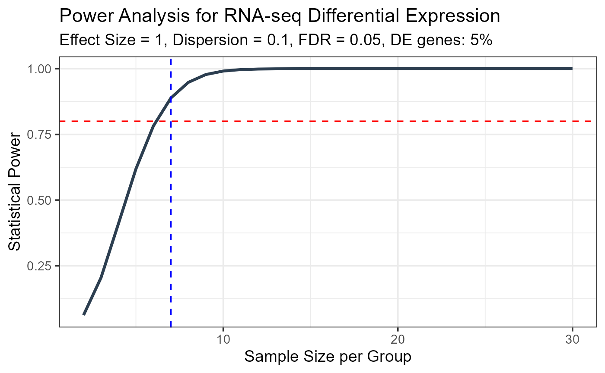
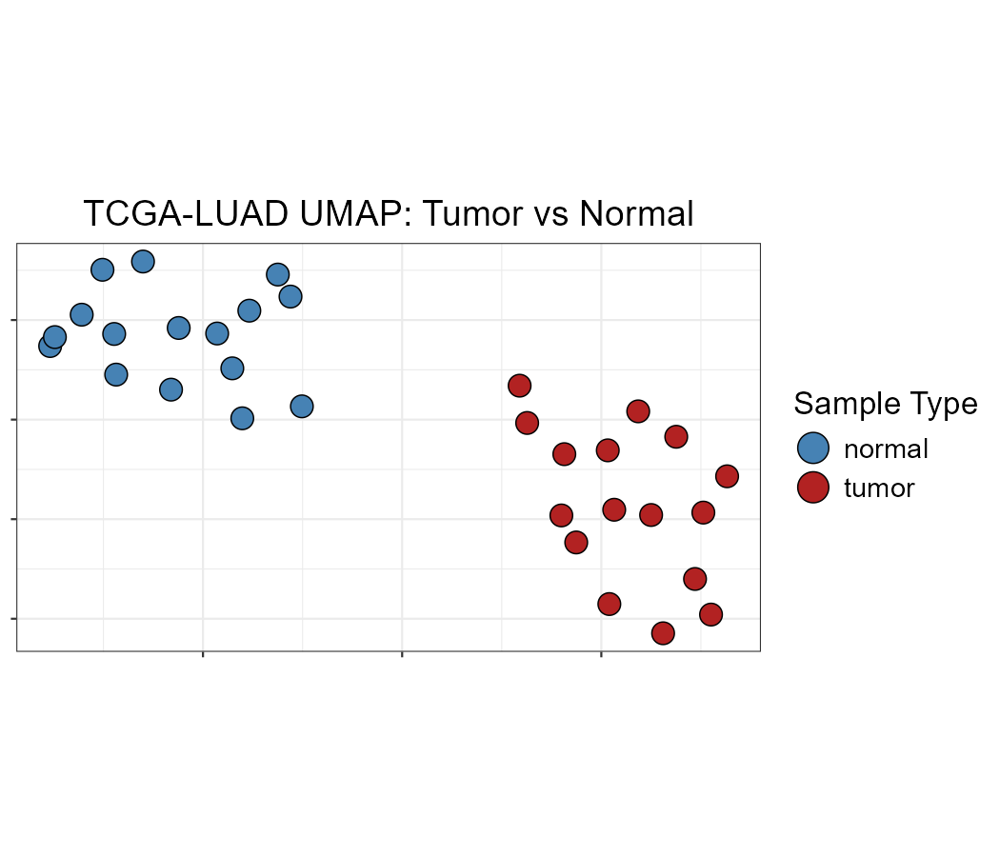

# Differential Expression Analysis Workflow with OmicsKit

## Overview

This vignette demonstrates a complete RNA-seq differential expression
analysis (DEA) workflow using OmicsKit, from study design through
visualization, using real TCGA-LUAD data (16 tumor vs. 16 normal lung
samples).

The workflow covers:

1.  **Study design** : statistical power estimation
2.  **Quality control** : unsupervised dimensionality reduction
3.  **DEA results** : annotation, normalization, and export
4.  **Visualization** : volcano plots and gene-level expression plots
5.  **Multi-comparison** : splitting genes into exclusive expression
    cases

## Required packages

``` r
library(OmicsKit)
library(ggplot2)
```

------------------------------------------------------------------------

## Section 1 : Study design: power analysis

Before collecting data or running any analysis, it is good practice to
estimate the minimum sample size needed to reliably detect
differentially expressed genes at a given effect size and false
discovery rate.

[`power_analysis()`](https://danielgarbozo.github.io/OmicsKit/reference/power_analysis.md)
computes statistical power across a range of sample sizes using an
analytical approximation that accounts for multiple testing:

``` r
result <- power_analysis(
  effect_size  = 1,      # minimum log2 fold-change to detect
  dispersion   = 0.1,    # biological coefficient of variation squared
  n_genes      = 20000,  # total genes tested
  prop_de      = 0.05,   # expected proportion of DE genes
  alpha        = 0.05,   # desired FDR
  power_target = 0.8,    # desired power (80%)
  max_n        = 30,
  plot         = TRUE
)

# Minimum samples per group needed
result$min_sample_size
#> [1] 7

# Full power curve
head(result$power_table)
#>   SampleSize      Power
#> 1          2 0.06234486
#> 2          3 0.20477735
#> 3          4 0.41078547
#> 4          5 0.61880322
#> 5          6 0.78217643
#> 6          7 0.88846759

# See plot
result$plot
```




Statistical power vs. sample size per group. The red dashed line marks
80% power; the blue dashed line marks the minimum required sample size.

The TCGA-LUAD dataset used in this vignette has 16 samples per group,
well above the minimum required for detecting log2FC ≥ 1 at 80% power.

------------------------------------------------------------------------

## Section 2 : Quality control: unsupervised clustering

Before running DEA, it is essential to verify that samples cluster by
their biological group and to detect potential batch effects or
outliers. OmicsKit provides three complementary dimensionality reduction
methods that all accept the same VST-transformed count matrix.

**Why VST?** Variance Stabilizing Transformation removes the
mean-variance dependence of RNA-seq counts, placing all genes on a
comparable log2-like scale. This prevents highly expressed genes from
dominating the sample-level distances.

``` r
data(vst_counts)
data(sampledata)

# nice_PCA, nice_UMAP, and nice_tSNE require a column named "id"
sampledata_dim <- sampledata
colnames(sampledata_dim)[colnames(sampledata_dim) == "patient_id"] <- "id"

dim(vst_counts)
#> [1] 21330    32
table(sampledata$sample_type)
#> 
#> normal  tumor 
#>     16     16
```

### PCA

PCA is the fastest method and should always be the first step. The first
two principal components often capture the main sources of variation.

``` r
nice_PCA(
  object       = vst_counts,
  annotations  = sampledata_dim,
  variables    = c(fill = "sample_type"),
  legend_names = c(fill = "Sample Type"),
  colors       = c("steelblue", "firebrick"),
  shapes       = c(21, 21),
  title        = "TCGA-LUAD PCA: Tumor vs Normal"
)
```


PCA of VST-transformed TCGA-LUAD counts. Tumor (red) and normal (blue)
samples separate cleanly along PC1.

### UMAP

UMAP captures non-linear structure and is particularly useful for larger
datasets or when PCA does not show clear separation.

``` r
nice_UMAP(
  object       = vst_counts,
  annotations  = sampledata_dim,
  variables    = c(fill = "sample_type"),
  legend_names = c(fill = "Sample Type"),
  colors       = c("steelblue", "firebrick"),
  shapes       = c(21, 21),
  title        = "TCGA-LUAD UMAP: Tumor vs Normal",
  neighbors    = 5,
  epochs       = 1000,
  seed         = 174
)
```



UMAP of VST-transformed TCGA-LUAD counts.

### tSNE

tSNE is useful for visualizing tight local clusters. Note that
`perplexity` must be less than one-third of the number of samples.

``` r
# With 32 samples, perplexity must be < 10
nice_tSNE(
  object         = vst_counts,
  annotations    = sampledata_dim,
  perplexity     = 5,
  max_iterations = 1000,
  variables      = c(fill = "sample_type"),
  legend_names   = c(fill = "Sample Type"),
  colors         = c("steelblue", "firebrick"),
  shapes         = c(21, 21),
  title          = "TCGA-LUAD tSNE: Tumor vs Normal",
  seed           = 174
)
```


tSNE of VST-transformed TCGA-LUAD counts.

------------------------------------------------------------------------

## Section 3 : DEA results: annotation, normalization, and export

Once QC confirms clean group separation, we work with the DESeq2
results. The `deseq2_results` object is already provided as an example
dataset.

``` r
data(deseq2_results)
data(norm_counts)

# Overview
dim(deseq2_results)
#> [1] 21330     7
sum(deseq2_results$padj < 0.05, na.rm = TRUE)
#> [1] 10910
```

### Gene annotations

[`get_annotations()`](https://danielgarbozo.github.io/OmicsKit/reference/get_annotations.md)
queries Ensembl via biomaRt to retrieve gene symbols, biotype,
chromosomal location, and length. Requires an internet connection.

``` r
annotations <- get_annotations(
  ensembl_ids = deseq2_results$gene_id,
  mode        = "genes",
  version     = "Current",
  filename    = "luad_gene_annotations",
  format      = "csv"
)

head(annotations)
```

### Adding annotations to results and counts

[`add_annotations()`](https://danielgarbozo.github.io/OmicsKit/reference/add_annotations.md)
joins annotation columns to any matrix or data frame using Ensembl IDs
as the key:

``` r
# Add gene symbol and biotype to normalized counts
norm_counts_annot <- add_annotations(
  object    = norm_counts,
  reference = annotations,
  variables = c("symbol", "biotype")
)

head(norm_counts_annot[, c("geneID", "symbol", "biotype")])
```

### TPM normalization

While DESeq2 normalized counts are appropriate for DEA, TPM is useful
for comparing expression levels between genes within a sample. Note that
TPM requires accurate gene lengths,
[`get_annotations()`](https://danielgarbozo.github.io/OmicsKit/reference/get_annotations.md)
provides these via `$gene_length` (computed as `end - start + 1`).

``` r
gene_lengths <- annotations$gene_length[
  match(rownames(raw_counts), annotations$geneID)
]

tpm_matrix <- tpm(raw_counts, gene_lengths)

# Column sums should all equal 1,000,000
round(colSums(tpm_matrix)[1:3])
```

### Saving results

[`save_results()`](https://danielgarbozo.github.io/OmicsKit/reference/save_results.md)
exports three Excel files: all genes, over-expressed only, and
under-expressed only:

``` r
save_results(
  df           = deseq2_results,
  name         = "TCGA_LUAD_TumorVsNormal",
  l2fc         = 1,
  cutoff_alpha = 0.05
)
# Creates:
#   TCGA_LUAD_TumorVsNormal_full.xlsx
#   TCGA_LUAD_TumorVsNormal_up_log2FC>1_FDR<0.05.xlsx
#   TCGA_LUAD_TumorVsNormal_down_log2FC<1_FDR<0.05.xlsx
```

------------------------------------------------------------------------

## Section 4 : Visualization

### Volcano plot

The volcano plot is the standard way to visualize DEA results, showing
the relationship between effect size (log2FC) and significance (FDR).

> **Tip:** To display gene symbols instead of Ensembl IDs, run
> [`get_annotations()`](https://danielgarbozo.github.io/OmicsKit/reference/get_annotations.md)
> and join the `symbol` column to `deseq2_results` with
> [`add_annotations()`](https://danielgarbozo.github.io/OmicsKit/reference/add_annotations.md)
> before calling
> [`nice_Volcano()`](https://danielgarbozo.github.io/OmicsKit/reference/nice_Volcano.md).

``` r
nice_Volcano(
  results   = deseq2_results,
  x_var     = "log2FoldChange",
  y_var     = "padj",
  label_var = "gene_id",
  title     = "TCGA-LUAD: Tumor vs Normal",
  cutoff_y  = 0.05,
  cutoff_x  = 1,
  x_range   = 8,
  y_max     = 10
)
```


Volcano plot of TCGA-LUAD DEA results. Red: upregulated in tumor; blue:
downregulated; grey: not significant.

### Detectable genes

[`detect_filter()`](https://danielgarbozo.github.io/OmicsKit/reference/detect_filter.md)
identifies genes with reliable expression levels by applying thresholds
on baseMean and mean normalized counts per group.

``` r
# detect_filter requires a column named "ensembl"
res <- deseq2_results
colnames(res)[colnames(res) == "gene_id"] <- "ensembl"
rownames(res) <- res$ensembl

samples_normal <- sampledata$patient_id[sampledata$sample_type == "normal"]
samples_tumor  <- sampledata$patient_id[sampledata$sample_type == "tumor"]

detected <- detect_filter(
  norm.counts        = as.data.frame(norm_counts),
  df.BvsA            = res,
  samples.baseline   = samples_normal,
  samples.condition1 = samples_tumor,
  cutoffs            = c(50, 50, 0)
)

length(detected$DetectGenes)
```

### Significance stars

[`get_stars()`](https://danielgarbozo.github.io/OmicsKit/reference/get_stars.md)
converts FDR values to asterisk notation for annotation in plots:

``` r
data(deseq2_results)

res_stars <- deseq2_results
colnames(res_stars)[colnames(res_stars) == "gene_id"] <- "ensembl"

# Most significant gene
get_stars(
  geneID = res_stars$ensembl[1],
  object = res_stars
)
#> [1] "****"

# Least significant gene
get_stars(
  geneID = res_stars$ensembl[nrow(res_stars)],
  object = res_stars
)
#> [1] "ns"
```

### Gene-level expression: Violin-Scatter-Box plot

[`nice_VSB()`](https://danielgarbozo.github.io/OmicsKit/reference/nice_VSB.md)
shows the distribution of normalized expression for a single gene across
sample groups. The input is the normalized counts matrix.

``` r
top_gene <- deseq2_results$gene_id[1]

# Get symbol
#symbol <- deseq2_results$symbol[1]

nice_VSB(
  object      = norm_counts,
  annotations = sampledata,
  variables   = c(fill = "sample_type"),
  genename    = top_gene,
  categories  = c("normal", "tumor"),
  labels      = c("Normal", "Tumor"),
  colors      = c("steelblue", "firebrick"),
  shapes      = 21,
  markersize  = 3
)
```

> **Note: alternative using a DESeq2 object directly:** If you still
> have your `DESeqDataSet` object in your session, you can use
> `nice_VSB_DESeq2()` instead. It extracts the normalized counts
> internally via `DESeq2::counts(dds, normalized = TRUE)`, so you do not
> need to provide a separate `norm_counts` matrix:
>
> ``` r
> nice_VSB_DESeq2(
>   object     = dds,
>   variables  = c(fill = "sample_type"),
>   genename   = top_gene,
>   symbol     = "TP53",                 # optional: displayed in plot title
>   categories = c("normal", "tumor"),
>   labels     = c("Normal", "Tumor"),
>   colors     = c("steelblue", "firebrick"),
>   shapes     = 21,
>   markersize = 3
> )
> ```
>
> Use
> [`nice_VSB()`](https://danielgarbozo.github.io/OmicsKit/reference/nice_VSB.md)
> when working from a pre-computed normalized counts matrix, and
> `nice_VSB_DESeq2()` when the DESeq2 object is still available in your
> environment.


Violin-Scatter-Box plot of the most significant DEG across tumor and
normal samples.

------------------------------------------------------------------------

## Section 5 : Multi-comparison analysis (optional)

When a study includes three phenotypes (e.g., normal, primary tumor,
metastasis),
[`split_cases()`](https://danielgarbozo.github.io/OmicsKit/reference/split_cases.md)
classifies genes into 10 mutually exclusive expression patterns based on
significance and direction across all three pairwise comparisons.

``` r
# Requires three DESeq2 result data frames:
# df.BvsA : condition 1 vs baseline
# df.CvsA : condition 2 vs baseline
# df.BvsC : condition 1 vs condition 2

cases <- split_cases(
  df.BvsA             = df_tumor_vs_normal,
  df.CvsA             = df_meta_vs_normal,
  df.BvsC             = df_tumor_vs_meta,
  unique_id           = "ensembl",
  significance_var    = "padj",
  significance_cutoff = 0.05,
  change_var          = "log2FoldChange",
  change_cutoff       = 1
)

# Number of genes per case
sapply(cases, nrow)

# Case 1: ladder genes : progressive up or down across all comparisons
head(cases$Case1)
```

------------------------------------------------------------------------

## Full workflow - summary

``` r
library(OmicsKit)

# 1. Study design
power_analysis(effect_size = 1, dispersion = 0.1, n_genes = 20000)

# 2. QC: dimensionality reduction (use VST counts)
data(vst_counts); data(sampledata)
sampledata$id <- sampledata$patient_id

nice_PCA(vst_counts, sampledata, variables = c(fill = "sample_type"),
         legend_names = c(fill = "Sample Type"),
         colors = c("steelblue", "firebrick"), shapes = c(21, 21))

# 3. Annotate and export results
annotations <- get_annotations(deseq2_results$gene_id)
norm_counts_annot <- add_annotations(norm_counts, annotations)
save_results(deseq2_results, name = "TumorVsNormal", l2fc = 1)

# 4. Visualize and filter non-detectable genes
nice_Volcano(deseq2_results, x_var = "log2FoldChange",
             y_var = "padj", label_var = "gene_id",
             title = "Tumor vs Normal")

detected <- detect_filter(as.data.frame(norm_counts), deseq2_results,
                          samples.baseline = samples_normal,
                          samples.condition1 = samples_tumor)

nice_VSB(norm_counts, sampledata,
         variables = c(fill = "sample_type"),
         genename = detected$DetectGenes[1],
         categories = c("normal", "tumor"),
         labels = c("Normal", "Tumor"),
         colors = c("steelblue", "firebrick"))

# 5. Multi-comparison (if 3 phenotypes)
cases <- split_cases(df.BvsA, df.CvsA, df.BvsC)
```

------------------------------------------------------------------------

## Session info

``` r
sessionInfo()
#> R version 4.4.2 (2024-10-31 ucrt)
#> Platform: x86_64-w64-mingw32/x64
#> Running under: Windows 11 x64 (build 26200)
#> 
#> Matrix products: default
#> 
#> 
#> locale:
#> [1] LC_COLLATE=English_United States.utf8 
#> [2] LC_CTYPE=English_United States.utf8   
#> [3] LC_MONETARY=English_United States.utf8
#> [4] LC_NUMERIC=C                          
#> [5] LC_TIME=English_United States.utf8    
#> 
#> time zone: America/Bogota
#> tzcode source: internal
#> 
#> attached base packages:
#> [1] stats     graphics  grDevices utils     datasets  methods   base     
#> 
#> other attached packages:
#> [1] ggplot2_4.0.2       OmicsKit_1.0.0.0000
#> 
#> loaded via a namespace (and not attached):
#>  [1] gtable_0.3.6       jsonlite_2.0.0     dplyr_1.2.0        compiler_4.4.2    
#>  [5] tidyselect_1.2.1   jquerylib_0.1.4    png_0.1-8          systemfonts_1.3.2 
#>  [9] scales_1.4.0       textshaping_1.0.5  yaml_2.3.12        fastmap_1.2.0     
#> [13] R6_2.6.1           labeling_0.4.3     patchwork_1.3.2    generics_0.1.4    
#> [17] knitr_1.51         htmlwidgets_1.6.4  tibble_3.3.1       desc_1.4.3        
#> [21] bslib_0.10.0       pillar_1.11.1      RColorBrewer_1.1-3 rlang_1.1.7       
#> [25] cachem_1.1.0       xfun_0.54          fs_1.6.7           sass_0.4.10       
#> [29] S7_0.2.1           otel_0.2.0         cli_3.6.5          withr_3.0.2       
#> [33] pkgdown_2.2.0      magrittr_2.0.4     digest_0.6.39      grid_4.4.2        
#> [37] rstudioapi_0.18.0  lifecycle_1.0.5    vctrs_0.7.1        evaluate_1.0.5    
#> [41] glue_1.8.0         farver_2.1.2       ragg_1.5.1         rmarkdown_2.30    
#> [45] tools_4.4.2        pkgconfig_2.0.3    htmltools_0.5.9
```
