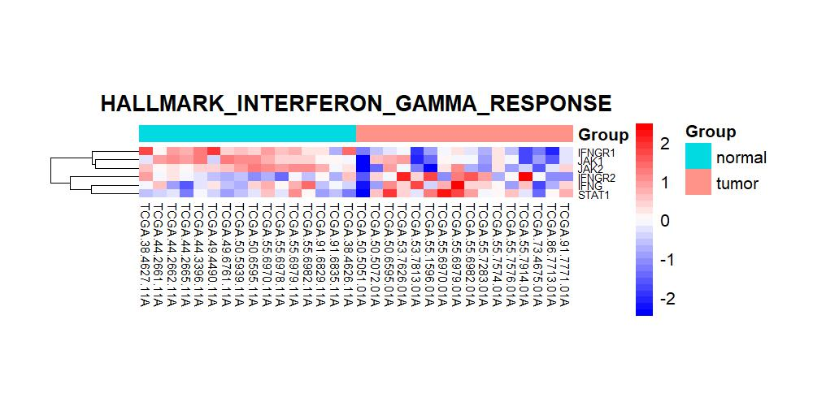
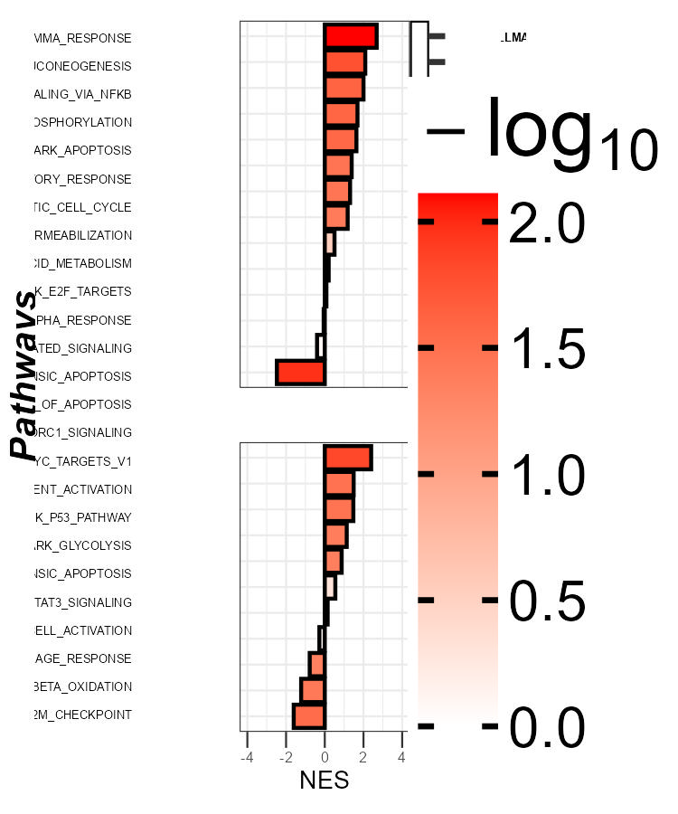
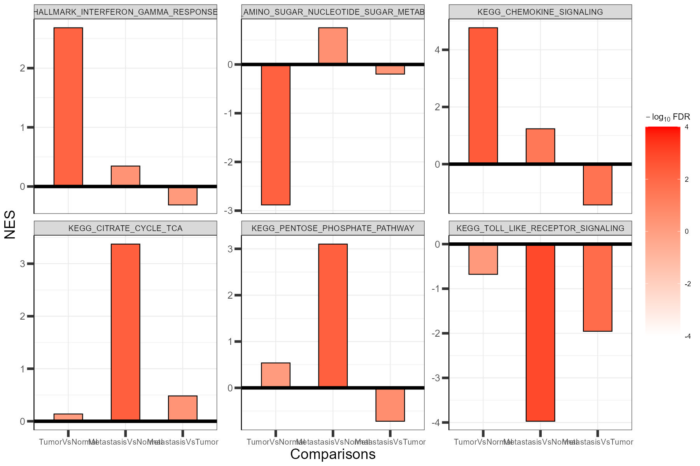

```{r setup, include = FALSE}
knitr::opts_chunk$set(
  collapse  = TRUE,
  comment   = "#>",
  fig.align = "center",
  warning   = FALSE,
  message   = FALSE
)
```
## Overview
This vignette demonstrates a complete gene set enrichment analysis (GSEA)
downstream workflow using OmicsKit, from loading gene sets through
publication-quality visualization.
The workflow covers:
1. **Loading gene sets** : reading GMT files with `list_gmts()`
2. **Merging results** : combining multi-collection GSEA TSV files with
   `merge_PA()`
3. **Gene extraction** : retrieving leading edge and top-ranked genes with
   `getgenesPA()` and annotating results with `addgenesPA()`
4. **Heatmaps** : visualizing gene expression per pathway with `heatmap_PA()`
   (file-path alternative: `heatmap_path_PA()`)
5. **Single-comparison plot** : `splot_PA()` : a publication-quality
   multi-panel barplot for one comparison
6. **Multi-comparison plot** : `multiplot_PA()` : faceted barplots comparing
   enrichment across conditions
## Required packages
```{r packages}
library(OmicsKit)
```
---
## Section 1 : Load gene sets
Gene sets used for enrichment analysis are stored as `.gmt` files, the
standard format used by MSigDB and other databases. `list_gmts()` reads all
`.gmt` files from a directory and returns a single named list, ready for
downstream use.
```{r list_gmts, eval = FALSE}
geneset_list <- list_gmts("path/to/your/gmt_folder/")
# How many gene sets were loaded?
length(geneset_list)
# Names of the first five gene sets
names(geneset_list)[1:5]
# Genes in one specific set
geneset_list[["HALLMARK_INTERFERON_GAMMA_RESPONSE"]]
```

For this vignette we use the built-in example `geneset_list`, which contains
40 curated gene sets across four biological themes (apoptosis, cell cycle,
immune response, and metabolism), and the built-in `gsea_results` dataset,
which mimics the output of `merge_PA()` for three comparisons across HALLMARK,
KEGG, and GO collections.
```{r load_data}
data(geneset_list)
data(gsea_results)
data(deseq2_results)
data(vst_counts)
data(sampledata)
# Ranked gene list: DESeq2 Wald stat from most positive to most negative
ranked_genes <- deseq2_results$gene_id[
  order(deseq2_results$stat, decreasing = TRUE)
]
# Overview of the enrichment results
dim(gsea_results)
unique(gsea_results$COMPARISON)
unique(gsea_results$COLLECTION)
```
---
## Section 2 : Merge GSEA results
In a real analysis, GSEA produces one results file per MSigDB collection
(e.g., `H.tsv` for HALLMARK, `C2.tsv` for KEGG). `merge_PA()` reads all
`.tsv` files from a directory, standardizes column names, parses the leading
edge string into numeric components (`tags`, `list`, `signal`), computes
`-log10(FDR)`, and returns a single combined data frame.
```{r merge_PA, eval = FALSE}
gsea_data <- merge_PA(
  input_directory = "path/to/gsea_results/",
  fdr_replace     = 0.001   # replace FDR = 0 (below permutation resolution)
)
# Inspect result
head(gsea_data[, c("NAME", "NES", "FDR", "COLLECTION", "COMPARISON", "tags")])
```
> **Note:** Each `.tsv` file must contain a `Comparison` column identifying
> the comparison name (e.g., `"TumorVsNormal"`). `merge_PA()` renames it to
> `COMPARISON` in the output. If your files come from a single run without
> that column, add it manually:
> ```r
> your_data$Comparison <- "TumorVsNormal"
> ```
The built-in `gsea_results` already has this structure:
```{r inspect_data}
# Key columns produced by merge_PA()
head(gsea_results[, c("NAME", "NES", "FDR", "Log10FDR",
                      "COLLECTION", "COMPARISON", "tags", "SIZE")])
```
---
## Section 3 : Extract leading edge genes
After obtaining pathway results, `getgenesPA()` retrieves the gene members
relevant to each enrichment signal. Three extraction modes are available:
- **`"le"`** (GSEA only): leading edge genes : the subset that drives the
  enrichment score.
- **`"top"`**: top-ranked *n* % of genes by rank metric : applicable to any
  enrichment method (GSEA, CAMERA, PADOG, etc.).
- **`"all"`**: all members of the gene set, ordered by rank.
`addgenesPA()` then appends the gene lists as comma-separated columns
(`le_genes`, `top_genes`, `all_genes`) to the pathway results table.

```{r getgenesPA_addgenesPA, eval = FALSE}
# Filter to one comparison
pa_single <- gsea_results[gsea_results$COMPARISON == "TumorVsNormal", ]
# Optional: define the top fraction for mode "top"
pa_single$top <- 0.30   # top 30% of gene set members by rank
# Extract genes using all three modes
gene_lists <- getgenesPA(
  pa_data      = pa_single,
  geneset_list = geneset_list,
  ranked_genes = ranked_genes,
  genes        = c("all", "le", "top")
)
# Inspect results for one pathway
gene_lists$le[["HALLMARK_INTERFERON_GAMMA_RESPONSE"]]   # leading edge
gene_lists$top[["HALLMARK_INTERFERON_GAMMA_RESPONSE"]]  # top 30% by rank
gene_lists$all[["HALLMARK_INTERFERON_GAMMA_RESPONSE"]]  # all members
# Append gene columns to the pathway table
pa_annot <- addgenesPA(pa_single, gene_lists)
head(pa_annot[, c("NAME", "all_genes", "le_genes", "top_genes")])
```
Let's run a minimal reproducible version with the built-in data:
```{r getgenesPA_addgenesPA_run}
pa_single     <- gsea_results[gsea_results$COMPARISON == "TumorVsNormal", ]
pa_single$top <- 0.30
gene_lists <- getgenesPA(
  pa_data      = pa_single,
  geneset_list = geneset_list,
  ranked_genes = ranked_genes,
  genes        = c("all", "le", "top")
)
pa_annot <- addgenesPA(pa_single, gene_lists)
# Number of gene sets annotated
nrow(pa_annot)
# Gene columns added
grep("_genes$", colnames(pa_annot), value = TRUE)
# Leading edge genes for one pathway
gene_lists$le[["HALLMARK_INTERFERON_GAMMA_RESPONSE"]]
```

> **Tip:** For CAMERA or other enrichment methods that do not produce leading
> edge information, use `genes = c("all", "top")` and set `pa_data$top` to
> your desired fraction (e.g., `0.25` for the top 25 % by rank). Do not
> request `genes = "le"` without a `tags` column.
---
## Section 4 : Heatmaps
### `heatmap_PA()` : R-object workflow
`heatmap_PA()` generates one heatmap per gene set in `pa_data_annot`. Genes
are ordered within each heatmap by their position in `ranked_genes`. Output
files are organized into subdirectories by format (PDF / JPG) and gene
selection mode (`all_genes`, `le_genes`, `top_genes`).
```{r heatmap_PA, eval = FALSE}

heatmap_PA(
  expression_data = vst_counts,
  metadata        = sampledata,
  pa_data_annot   = pa_annot,
  ranked_genes    = ranked_genes,
  plot_genes      = c("all_genes", "le_genes", "top_genes"),
  sample_col      = "patient_id",
  group_col       = "sample_type",
  out_dir         = "heatmaps_PA",
  pdf             = TRUE,
  jpg             = TRUE
)
# Creates, for example:
#   heatmaps_PA/jpg/top_genes/HALLMARK_INTERFERON_GAMMA_RESPONSE_heatmap.jpg
#   heatmaps_PA/pdf/le_genes/HALLMARK_INTERFERON_GAMMA_RESPONSE_heatmap.pdf
#   ... (one file per gene set per format per mode)
```
The heatmap below shows the top-ranked genes for
`HALLMARK_INTERFERON_GAMMA_RESPONSE` across tumor and normal TCGA-LUAD
samples:
```{r heatmap_plot, echo = FALSE, fig.cap = "Expression heatmap of top-ranked genes in HALLMARK_INTERFERON_GAMMA_RESPONSE across TCGA-LUAD tumor and normal samples. Genes are ordered by DESeq2 Wald statistic (most upregulated at top).", fig.width = 7, fig.height = 6}


```
### `heatmap_path_PA()` : file-path alternative
`heatmap_path_PA()` is a convenience wrapper that reads all inputs from disk
(expression TSV, metadata XLSX, GMT file, ranked-genes TSV, GSEA TSV) and
calls the same heatmap engine internally. It is useful when running the
analysis immediately after GSEA without loading data into R.
```{r heatmap_path_PA, eval = FALSE}

heatmap_path_PA(
  main_dir          = "path/to/analysis/",
  expression_file   = "vst_expression.tsv",
  metadata_file     = "metadata.xlsx",
  gmt_file          = "h.all.v2023.symbols.gmt",
  ranked_genes_file = "ranked_genes.tsv",
  gsea_file         = "H.tsv",
  output_dir        = "leading_edge_heatmaps",
  sample_col        = "patient_id",
  group_col         = "sample_type",
  save_dataframe    = TRUE   # also saves intermediate gene table as .tsv
)
# Produces the same output as heatmap_PA() for a single GSEA file
```
> **Which function to use?** Prefer `heatmap_PA()` when your data are already
> in R (e.g., after calling `merge_PA()`, `getgenesPA()`, and `addgenesPA()`).
> Use `heatmap_path_PA()` when you want a quick one-call solution that reads
> directly from files on disk. Both functions produce identical heatmaps.
---
## Section 5 : Single-comparison plot
`splot_PA()` generates a publication-quality multi-panel enrichment plot for
**one comparison**. Gene sets appear on the y-axis (grouped by MSigDB
collection), NES on the x-axis, and −log10(FDR) as fill color. Six panels
are assembled side-by-side using `patchwork`.
```{r splot_PA, eval = FALSE}

single <- gsea_results[gsea_results$COMPARISON == "TumorVsNormal", ]
splot_PA(
  data           = single,
  geneset_col    = "NAME",
  collection_col = "COLLECTION",
  nes_col        = "NES",
  fdr_col        = "FDR",
  order          = "desc",
  fill_limits    = c(0, 5),         # cap at -log10(FDR) = 5
  fill_palette   = c("white", "red")
)
```

```{r splot_plot, echo = FALSE, fig.cap = "Single-comparison pathway enrichment plot (TumorVsNormal). Gene sets are sorted by NES; fill color encodes -log10(FDR), capped at 5. Collections are annotated to the right.", fig.width = 9, fig.height = 7}

```
> **Tip:** Use `fill_limits = c(0, 5)` to prevent a handful of extremely
> significant gene sets from washing out the color contrast for the rest. Any
> pathway with FDR ≤ 0.00001 will be shown in the maximum color (red).
---
## Section 6 : Multi-comparison plot
`multiplot_PA()` generates a **faceted barplot** showing NES across multiple
comparisons for a selected set of gene sets. Each facet represents one gene
set; bars represent the NES per comparison, colored by −log10(FDR). This
layout makes it straightforward to assess how enrichment changes across
conditions.
```{r multiplot_PA, eval = FALSE}

# Subset to pathways of interest across all comparisons
pathways_of_interest <- c(
  "HALLMARK_INTERFERON_GAMMA_RESPONSE",
  "HALLMARK_INFLAMMATORY_RESPONSE",
  "HALLMARK_G2M_CHECKPOINT",
  "HALLMARK_E2F_TARGETS",
  "HALLMARK_GLYCOLYSIS",
  "HALLMARK_OXIDATIVE_PHOSPHORYLATION"
)
multi_data <- gsea_results[gsea_results$NAME %in% pathways_of_interest, ]
multiplot_PA(
  data             = multi_data,
  comparison_col   = "COMPARISON",
  facet_col        = "NAME",
  axis_y           = "NES",
  fdr_col          = "FDR",
  comparison_order = c("TumorVsNormal",
                       "MetastasisVsNormal",
                       "MetastasisVsTumor"),
  custom_labels    = c(
    TumorVsNormal       = "Tumor",
    MetastasisVsNormal  = "Meta",
    MetastasisVsTumor   = "Meta/Tumor"
  ),
  ncol_wrap        = 3,
  free_y           = TRUE,
  fill_limits      = c(0, 5),
  fill_palette     = c("white", "red")
)
```

```{r multiplot_plot, echo = FALSE, fig.cap = "Multi-comparison pathway enrichment plot. Each facet shows NES for one HALLMARK gene set across three pairwise comparisons. Fill color encodes -log10(FDR), capped at 5.", fig.width = 10, fig.height = 8}

```
> **Tip:** Use `comparison_order` to control the left-to-right arrangement of
> comparisons on the x-axis of each facet, and `custom_labels` to replace
> long comparison names with shorter axis labels.
---
## Full workflow : summary
```{r full_workflow, eval = FALSE}
library(OmicsKit)

# ── 1. Load gene sets ────
gsl <- list_gmts("path/to/gmt_folder/")

# ── 2. Merge GSEA output TSV files ───
gsea_data <- merge_PA(
  input_directory = "path/to/gsea_results/",
  fdr_replace     = 0.001
)
# ── 3. Build ranked gene list (from DESeq2 stat or log2FC) ─────
ranked <- deseq2_results$gene_id[
  order(deseq2_results$stat, decreasing = TRUE)
]
# ── 4. Extract leading edge and top-ranked genes ───
pa_single     <- gsea_data[gsea_data$COMPARISON == "TumorVsNormal", ]
pa_single$top <- 0.30
gene_lists <- getgenesPA(pa_single, gsl, ranked, genes = c("all", "le", "top"))
pa_annot   <- addgenesPA(pa_single, gene_lists)
# ── 5. Heatmaps ──────────
heatmap_PA(
  expression_data = vst_counts,
  metadata        = sampledata,
  pa_data_annot   = pa_annot,
  ranked_genes    = ranked,
  plot_genes      = c("all_genes", "le_genes", "top_genes"),
  sample_col      = "patient_id",
  group_col       = "sample_type",
  out_dir         = "heatmaps_PA"
)
# Alternative: file-path version (reads directly from disk)
heatmap_path_PA(
  main_dir          = "path/to/analysis/",
  expression_file   = "vst_expression.tsv",
  metadata_file     = "metadata.xlsx",
  gmt_file          = "h.all.v2023.symbols.gmt",
  ranked_genes_file = "ranked_genes.tsv",
  gsea_file         = "H.tsv",
  output_dir        = "leading_edge_heatmaps"
)
# ── 6. Single-comparison enrichment plot ───────────
splot_PA(
  data           = pa_single,
  geneset_col    = "NAME",
  collection_col = "COLLECTION",
  nes_col        = "NES",
  fdr_col        = "FDR",
  fill_limits    = c(0, 5)
)
# ── 7. Multi-comparison enrichment plot ────────────
pathways_oi <- c(
  "HALLMARK_INTERFERON_GAMMA_RESPONSE",
  "HALLMARK_INFLAMMATORY_RESPONSE",
  "HALLMARK_G2M_CHECKPOINT"
)
multiplot_PA(
  data             = gsea_data[gsea_data$NAME %in% pathways_oi, ],
  comparison_col   = "COMPARISON",
  facet_col        = "NAME",
  fdr_col          = "FDR",
  comparison_order = c("TumorVsNormal", "MetastasisVsNormal", "MetastasisVsTumor"),
  ncol_wrap        = 3
)
```
---
## Session info
```{r session_info}
sessionInfo()
```
